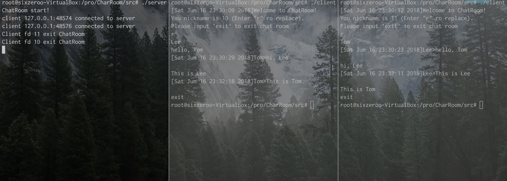

# ChatRoom

基于I/O多路复用epoll实现的高并发在线聊天室

## feature
* epoll 实现高并发
* 用类实现epoll针对Socket操作的封装（SocketEpoll类）
* 日志功能
* 通过文件加载配置

## 效果

## To do
* 处理由Ctrl+C引发的SIGINT等信号
* 在客户端对终端编程，实现输入和显示的分离
* 添加认证机制
* 添加创建多个聊天室功能

